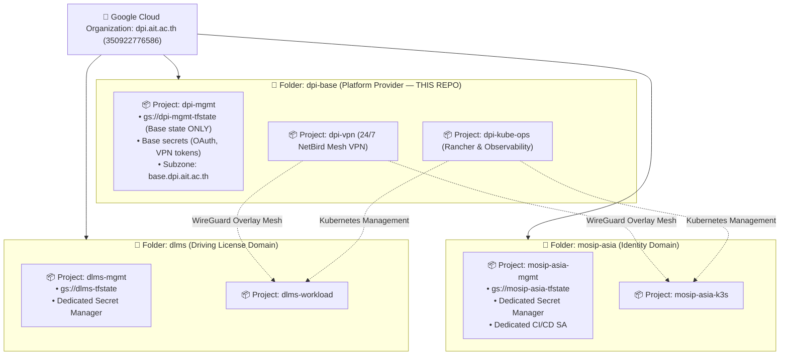

# DPI Center Base (`dpi-base`) — Operations & Infrastructure Hub

Welcome to the **DPI Center (Digital Public Infrastructure Center)** central operations repository, infrastructure runbook, organization management plane, and GitOps hub.

---

## 📌 What This Repository Is For

This repository acts as the **single source of truth** and **Platform Engine** for the DPI Center under Google Cloud Organization **`dpi.ait.ac.th`** (Org ID: `350922776586`).

It manages:
1. **Core Management Plane (`dpi-mgmt`)**: Authoritative Cloud DNS subzones, IAM governance, automated Secret Manager storage, and GCS remote state for platform foundation.
2. **Network Fabric (`dpi-vpn`)**: 24/7 NetBird WireGuard mesh VPN connecting all distributed clusters and developer workstations over private overlay IPs (`100.64.0.0/16`).
3. **Multi-Cluster Control Plane (`dpi-kube-ops`)**: On-demand Rancher Kubernetes manager (with GCP Instance Schedules for 65–75% cost savings) and ultra-low overhead telemetry (VictoriaMetrics + Grafana Loki).
4. **Landing Zone Automation (`scripts/`)**: Idempotent bootstrap tooling (`bootstrap_domain.sh`, `check_env.sh`) that provisions new Sovereign Domains in 60 seconds.

---

## 🏗️ Architecture: Platform Engine vs. Sovereign Domains

DPI Center enforces a **Federated Domain Landing Zone Pattern**:
* **`dpi-base` (This Repository & Folder)**: The **Platform Engine**. Contains only shared network fabric, cluster management, and base foundation. Remote state (`gs://dpi-mgmt-tfstate`) and secrets in `dpi-mgmt` are **strictly scoped to `dpi-base` only**.
* **Workload Domains (`mosip-asia`, `dlms`, `ai-team`, etc.)**: Autonomous product initiatives. Each domain receives its own GCP Folder, dedicated grant billing account, and dedicated **`<domain>-mgmt` anchor project** (`gs://<domain>-tfstate`) with zero blast radius to `dpi-base`.



---

## 👥 Identity & Governance Model

We enforce a strict separation between break-glass recovery and daily operational identities:

| Identity | Entity | Role in Infrastructure | Governance Standard |
| :--- | :--- | :--- | :--- |
| **`admin@dpi.ait.ac.th`** | Cloud Identity Root | **Super Administrator** | Root break-glass recovery account for Google Admin Console and Org policies. Never used for daily CLI operations. |
| **`akraradet@ait.asia`** | DPI Operations | **Operating Administrator** | Daily administrative identity. Holds `roles/resourcemanager.organizationAdmin`, `roles/billing.admin`, `roles/resourcemanager.projectCreator`. |
| **`nuttasit@ait.asia`** | DPI Operations | **Operating Administrator** | Daily administrative identity. Holds `roles/resourcemanager.organizationAdmin`, `roles/billing.admin`, `roles/resourcemanager.projectCreator`. |
| **`dpi.ait.ac.th`** | Apex Domain | **Cloud Identity Free** | Free identity tier ($0/mo, Org ID: `350922776586`) governing all DPI projects, folders, and IAM policies. |

---

## 📁 Repository Directory Structure

```text
dpi-base/
├── README.md                      # What this repository is for (this file)
├── STATUS.md                      # Current situation, deployment checklist & roadmap
├── AGENTS.md                      # AI Assistant operating guidelines & invariants
├── GEMINI.md                      # Pointer to AGENTS.md
├── .env.example                   # Domain configuration template (copy to .env)
│
├── scripts/                       # Platform Automation & Admin Tooling
│   ├── check_env.sh               # Pre-flight environment & GCP API validator
│   └── bootstrap_domain.sh        # Seed bootstrap with --plan & idempotent apply
│
├── docs/                          # Standard Operating Procedures (Runbooks)
│   └── sop.md                     # Master SOP: New Domain, New Project, Base Infra
│
├── dpi-mgmt/                      # GCP Project: dpi-mgmt (Cloud DNS & Governance)
│   ├── oauth_setup.md             # Google OAuth2 / OIDC console setup SOP
│   └── terraform/                 # Foundation Cloud DNS, IAM, Secrets, GCS State
│
├── dpi-vpn/                       # GCP Project: dpi-vpn (NetBird Mesh VPN)
│   ├── terraform/                 # e2-small VM, static IP, firewall rules
│   └── docker/                    # NetBird docker-compose & reverse proxy configs
│
└── dpi-kube-ops/                  # GCP Project: dpi-kube-ops (Rancher & Observability)
    ├── terraform/                 # e2-standard-4 VM, Instance Schedule, K3s startup
    └── helm/                      # Rancher Community, VictoriaMetrics & Grafana values
```

---

## 🔗 Quick Navigation

* 🚦 **Current Situation & Deployment Progress**: See [`STATUS.md`](STATUS.md).
* 📖 **How to Add a New Domain, Project, or Infra**: Follow [`docs/sop.md`](docs/sop.md).
* 🎯 **GitHub Milestones & Tracking**: [GitHub Epic #1](https://github.com/mosip-asia/dpi-base/issues/1).
