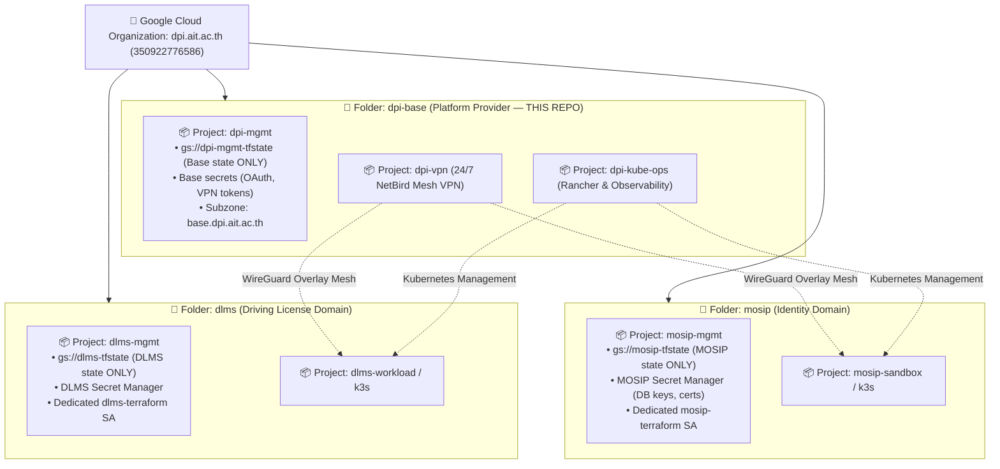

# DPI Center Base (`dpi-base`) — Operations & Infrastructure Hub

Welcome to the **DPI Center (Digital Public Infrastructure Center)** central knowledge base, infrastructure runbook, organization management plane, and GitOps configuration repository.

---

## 📌 Repository Overview

This repository serves as the single source of truth for:
* **GCP Organization Governance**: Google Cloud Identity Free & Organization administration for **`dpi.ait.ac.th`** (Org ID: `350922776586`).
* **Grant Billing & Resource Governance**: Multi-billing account architecture, grant accounting, and payment SOP in [`docs/governance/gcp_billing_and_management.md`](docs/governance/gcp_billing_and_management.md).
* **Team Onboarding & Decisions**: Complete Architecture Decision Records in [`docs/decisions_and_onboarding.md`](docs/decisions_and_onboarding.md).
* **Cloud Management Plane (`dpi-mgmt/`)**: Authoritative Cloud DNS, root IAM governance, automated Secret Manager key storage, and Single Sign-On (SSO) credentials.
* **Domain Landscape**: Public DNS records, routing, and email routing for `dpi.ait.ac.th` and managed subdomains.
* **Service Admin & Workload Runbooks**: Infrastructure definitions and deployment guides for DPI research platforms, identity infrastructure, and digital public goods (including **MOSIP** and **DLMS**).

---

## 🏗️ Architecture & Domain Landscape

DPI Center operates as an independent organization with dedicated cloud governance:

```
┌─────────────────────────────────────────────────────────────────────────────────┐
│                           DPI DOMAIN & IDENTITY LANDSCAPE                       │
└─────────────────────────────────────────────────────────────────────────────────┘
                                         │
        ┌────────────────────────────────┴────────────────────────────────┐
        ▼                                                                 ▼
┌────────────────────────────────────────┐      ┌────────────────────────────────────────┐
│          Operating Admins              │      │            DPI Apex Domain             │
│  `akraradet@ait.asia` & `nuttasit@...` │      │            `dpi.ait.ac.th`             │
├────────────────────────────────────────┤      ├────────────────────────────────────────┤
│ - Primary Technical & IAM Admins       │      │ - Google Cloud Organization Root       │
│ - Non-expiring operational identities  │      │ - Authoritative Cloud DNS Apex         │
│ - Org Admins & Billing Admins in GCP   │      │ - `admin@dpi.ait.ac.th` (Super Admin)  │
└────────────────────────────────────────┘      └────────────────────────────────────────┘
```

### Identity & Governance Matrix

| Identity / Domain | Entity | Role in Infrastructure | Governance Standard |
| :--- | :--- | :--- | :--- |
| **`admin@dpi.ait.ac.th`** | Cloud Identity Root | **Super Administrator** | Root break-glass recovery account for Google Admin Console and Org policies. |
| **`akraradet@ait.asia`** | DPI Operations | **Operating Admin** | Daily administrative identity. Holds `roles/resourcemanager.organizationAdmin`, `roles/billing.admin`, `roles/resourcemanager.projectCreator`. |
| **`nuttasit@ait.asia`** | DPI Operations | **Operating Admin** | Daily administrative identity. Holds `roles/resourcemanager.organizationAdmin`, `roles/billing.admin`, `roles/resourcemanager.projectCreator`. |
| **`dpi.ait.ac.th`** | DPI Apex Domain | **Google Cloud Organization** | Standalone Cloud Identity Free organization ($0/mo, Org ID: `350922776586`) governing all DPI projects, folders, and IAM policies. |


---

### 🛡️ Platform Engine vs. Sovereign Workload Domains

DPI Center enforces a **Federated Domain Landing Zone Pattern**:
* **`dpi-base` (This Repository & Folder)**: The **Platform Engine**. Contains only shared network fabric, cluster control, and base infrastructure. The remote state (`gs://dpi-mgmt-tfstate`) and secrets in `dpi-mgmt` are **strictly scoped to `dpi-base` only**.
* **Workload Domains (`mosip`, `dlms`, etc.)**: Autonomous product initiatives. Each domain receives its own GCP Folder and its own dedicated **`*-mgmt` anchor project** with isolated GCS remote state, Secret Manager, and billing tracking.



### 🗄️ Standard Domain Blueprint (`<domain>-mgmt`)

To ensure zero blast radius, donor grant accounting, and multi-repo autonomy, every new initiative follows this standardized blueprint:

| Layer | Responsibility | Target Resource | Scope & Isolation Rule |
| :--- | :--- | :--- | :--- |
| **Core Base** | Platform & Fabric | **`dpi-base`** (`dpi-mgmt`) | **Strictly scoped to `dpi-base`**. Stores state for VPN, Rancher, and base subzone (`base.dpi.ait.ac.th`). Never holds application secrets. |
| **Workload Domain** | Product Management | **`<domain>-mgmt`** (e.g. `mosip-mgmt`) | **Autonomous per domain**. Dedicated GCS bucket (`gs://<domain>-tfstate`) and dedicated Secret Manager. Completely isolated from `dpi-mgmt`. |
| **Workload Compute**| Application Workloads | **`<domain>-*`** (e.g. `mosip-sandbox`) | Research/testbed K3s nodes. Connects to `dpi-vpn` for secure mesh overlay; managed via `dpi-kube-ops`. |
| **Subdomain Routing**| DNS Namespaces | **`<domain>.demo.dpi.ait.ac.th`** | Delegated via NS records to `<domain>-mgmt` Cloud DNS for autonomous record management. |

---

## 📁 Repository Directory Structure

The repository structure matches our GCP projects with 1-to-1 symmetry:

```text
dpi-base/
├── README.md                      # Central landing page & architecture overview (this file)
├── AGENTS.md                      # AI Assistant context, system architecture, and operating rules
├── GEMINI.md                      # Shortcut pointer to AGENTS.md
│
├── docs/                          # 📋 Operational SOPs, ADRs & Infrastructure Runbooks
│   ├── decisions_and_onboarding.md # Complete team onboarding guide & architecture decisions
│   ├── governance/                # 💳 GCP Multi-Billing, Grant Accounting & Resource SOP
│   │   └── gcp_billing_and_management.md
│   └── infra/network/             # DNS topology and network runbooks
│
├── dpi-mgmt/                      # 🛡️ GCP Project: `dpi-mgmt` (Cloud DNS & Governance)
│   ├── checklist.md               # Master phase tracking checklist
│   ├── oauth_setup.md             # Google OAuth2 / OIDC console setup SOP
│   └── terraform/                 # Foundation Cloud DNS, IAM, Secrets, GCS State
│
├── dpi-vpn/                       # 🌐 GCP Project: `dpi-vpn` (NetBird Mesh VPN)
│   ├── terraform/                 # e2-small VM, static IP, firewall rules
│   └── docker/                    # NetBird docker-compose & reverse proxy configs
│
└── dpi-kube-ops/                  # 📊 GCP Project: `dpi-kube-ops` (Rancher & Observability)
    ├── terraform/                 # e2-standard-4 VM, Instance Schedule, K3s startup
    └── helm/                      # Rancher Community, VictoriaMetrics & Grafana values
```

---

## 🚀 Quick Start & Next Steps

1. Read the **Team Onboarding & Architecture Decisions** in [`docs/decisions_and_onboarding.md`](docs/decisions_and_onboarding.md).
2. Review the implementation checklist in [`dpi-mgmt/checklist.md`](dpi-mgmt/checklist.md).
3. Track active milestones on **[GitHub Epic #1](https://github.com/mosip-asia/dpi-base/issues/1)**.

