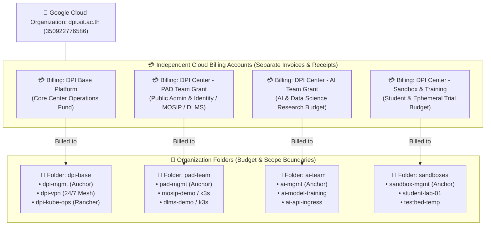

# GCP Governance, Resource Hierarchy & Grant Billing SOP — DPI Center

**Document Version**: 1.0  
**Target Organization**: `dpi.ait.ac.th` (Org ID: `350922776586`)  
**Audience**: Principal Investigators (PIs), Operating Administrators, Project Leads, University Finance & Grants Office

---

## 🎯 1. Executive Summary & Core Principles

The Digital Public Infrastructure Center (DPI Center) operates a multi-project, multi-tenant cloud infrastructure funded through distinct institutional grants, donor programs (e.g. World Bank, Gates Foundation, MOSIP), and university research funds.

To eliminate financial entanglement, prevent "bill shock," and ensure seamless grant reimbursement audits, we enforce three foundational governance rules:

1. **1-to-1 Grant-to-Billing Alignment**: Every research grant or operational team maintains its own **dedicated Google Cloud Billing Account**. Monthly invoices and payment receipts are issued separately under the exact grant title.
2. **Sovereign Domain Landing Zones**: Each team/initiative operates inside its own GCP Folder anchored by an isolated **`*-mgmt` project**. Application state (`gs://<domain>-tfstate`) and secrets **never** mix with the core platform (`dpi-mgmt`).
3. **Prepaid Top-Up & Zero-Liability Payments**: To solve the credit card liability problem for academic staff, all spending uses manual prepaid top-ups ("Make a payment") aligned with approved grant budget lines before compute is consumed.

---

## 🏛️ 2. Organization & Resource Hierarchy Matrix

Google Cloud supports multiple independent Cloud Billing Accounts under a single organization. This enables centralized identity and policy governance while keeping financial liability completely partitioned:



### Resource Allocation Matrix

| Team / Grant Area | Cloud Billing Account Name | Linked GCP Folder | Anchor Project | Workload Projects | Target Monthly Budget |
| :--- | :--- | :--- | :--- | :--- | :--- |
| **Platform Engine** | `DPI Center - Base Platform` | `dpi-base/` | `dpi-mgmt` | `dpi-vpn`, `dpi-kube-ops` | ~$40 – $90 / mo (Controlled via Instance Schedules) |
| **PAD / Identity Team** | `DPI Center - PAD Team Grant` | `pad-team/` | `pad-mgmt` | `mosip-demo`, `dlms-demo` | Billed directly to PAD / MOSIP Research Grant |
| **AI & Data Science Team**| `DPI Center - AI Team Grant` | `ai-team/` | `ai-mgmt` | `ai-model-training`, `ai-api` | Billed directly to AI Research Grant |
| **Developer Sandboxes** | `DPI Center - Sandbox & Training` | `sandboxes/` | `sandbox-mgmt` | `sandbox-a`, student labs | Billed to Center Training / Student Budget |

---

## 💳 3. Payment Instruments & The "Credit Card Problem"

In academic research centers, staff members often hesitate to attach personal credit cards to cloud platforms due to fear of runaway expenses, personal debt liability, and delayed university reimbursements.

The DPI Center solves this using **four practical financial models**:

### Model A: Dedicated Team / PI Card with Prepaid Top-Ups (Recommended Short-Term)
* **Who pays**: The Principal Investigator (PI) or designated Team Lead for that specific grant attaches their card **only** to their grant's billing account (e.g. PAD Team Lead attaches to `DPI Center - PAD Team Grant`).
* **The "Zero-Surprise" Prepaid Workflow**:
  1. **Never rely on monthly post-billing**: Do not wait for Google's automatic end-of-month invoice.
  2. **Pre-pay the exact grant allocation**: In the GCP Console, click **Payment overview → Make a payment** (Top-up). Enter the exact amount approved in the quarterly budget sheet (e.g. $150.00).
  3. **Instant PDF Receipt Generation**: Google Cloud immediately generates an official Tax Receipt with:
     * **Account Name**: `DPI Center - PAD Team Grant`
     * **Payment Description**: `Prepayment / Top-up`
     * **Amount**: `$150.00 Paid`
  4. **Immediate Reimbursement Submission**: The PI submits this official PDF receipt to AIT Finance / Grant Administration **on the same day**, getting reimbursed before their personal credit card statement is due.
  5. **Hard Budget Cap**: If funds reach $0, compute instances halt or trigger alerts; the card is never charged for unplanned runaway usage.

### Model B: University Corporate Purchasing Card (P-Card / Virtual Card)
* **Who pays**: AIT Finance issues a project-specific corporate card or single-use virtual debit/credit card linked to the specific grant account number.
* **Execution**: The virtual card is added as the primary payment method for that specific Billing Account.
* **Advantage**: Zero personal liability for researchers.

### Model C: Direct Institutional Invoicing / Cloud Reseller (Enterprise Scale)
* **When to activate**: When total center spend exceeds ~$300–$500/month or when donor contracts forbid credit card usage.
* **Who pays**: A certified Google Cloud Partner in Thailand / Southeast Asia (e.g. CloudMile, Tangerine, SoftwareONE) establishes an institutional invoicing agreement with the Asian Institute of Technology (AIT).
* **Execution**: Invoices are issued on Net-30 / Net-60 terms and paid via direct university bank wire transfer directly against institutional purchase orders (POs).

---

## 🛡️ 4. The Sovereign Domain Architecture (Asset Isolation)

To prevent cross-team contamination, **`dpi-mgmt` only manages `dpi-base`**. Workload teams must never share state or secrets with the platform engine.

Every team/domain follows the **Standard Domain Blueprint**:

```text
[Team Domain: e.g. pad-team]
├── 📁 Folder: pad-team/                        (GCP Resource Boundary)
│   ├── 📦 Project: pad-mgmt                   (Autonomous Anchor Plane)
│   │   ├── 🪣 Bucket: gs://pad-tfstate         (Singapore, Versioning ON)
│   │   ├── 🔑 Secret Manager: pad-db-password, signing-keys
│   │   └── 🤖 Service Account: pad-terraform@pad-mgmt.iam.gserviceaccount.com
│   │
│   └── 📦 Workload Projects:                  (Transient Compute Plane)
│       ├── mosip-demo                         (K3s cluster, joining NetBird mesh)
│       └── dlms-demo                          (K3s cluster, joining NetBird mesh)
```

### Operational Rules:
1. **State Isolation**: `gs://dpi-mgmt-tfstate` is strictly reserved for `dpi-base`. Workloads must store their state in `gs://<domain>-tfstate`.
2. **Secret Isolation**: Application database passwords, private keys, and user tokens are stored in `<domain>-mgmt` Secret Manager. Root infrastructure admins cannot accidentally expose application secrets.
3. **Subdomain Autonomy**: The apex zone delegates `pad.demo.dpi.ait.ac.th` to `<domain>-mgmt` Cloud DNS, giving the team full control over ingress URLs without touching the root domain.

---

## 🚨 5. Budget Threshold Alerts & Safety Runbook

Every Billing Account must have three automated budget threshold alerts configured:

| Threshold Percentage | Action Taken | Target Notification |
| :--- | :--- | :--- |
| **50% of Budget** | Early awareness warning | Email to Team Lead & Operating Admins |
| **80% of Budget** | Review compute consumption & shutdown idle VMs | Email + NetBird Slack / Teams webhook |
| **100% of Budget** | Critical cap reached. Review grant top-up or stop non-essential workloads | Urgent alert to PI and Center Operations |

### How to Configure Budget Alerts:
```bash
# Example: Setting a budget alert for PAD Team via gcloud / Console
# Target: 5,000 THB / $150 USD monthly target
gcloud billing budgets create \
    --billing-account=BILLING_ACCOUNT_ID \
    --display-name="PAD Grant Monthly Budget Cap" \
    --budget-amount=150USD \
    --threshold-rule=percent=0.5 \
    --threshold-rule=percent=0.8 \
    --threshold-rule=percent=1.0 \
    --all-updates-rule-notification-channels=PROJECT_NOTIFICATION_CHANNEL
```

---

## 📋 6. Financial Audit & Reconciliation Checklist

At the end of each fiscal month or grant milestone:

- [ ] **1. Download Official Tax Invoice**: In GCP Console → Billing → Invoices → Download official monthly tax invoice for each Billing Account.
- [ ] **2. Download Payment Top-up Receipts**: Billing → Transactions → Filter by "Payments" → Download PDF receipt matching the credit card charge.
- [ ] **3. Verify Project Attribution**: Ensure 100% of line items on that invoice belong to projects inside that team's folder.
- [ ] **4. Check Idle Resources**: Review whether schedulable instances (like Rancher in `dpi-kube-ops` or testbed nodes) were stopped during non-working hours.
- [ ] **5. Submit Grant Expense Packet**: Bundle the Google PDF Tax Receipt + Grant Budget Sheet Line Item → Submit to AIT Finance for formal grant audit sign-off.
