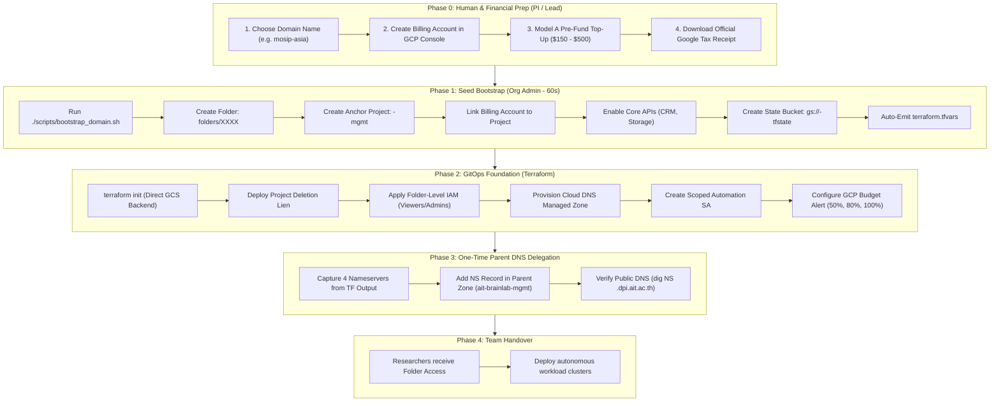

# Standard Operating Procedure (SOP): Provisioning New Sovereign Domains & Landing Zones

| Metadata | Value |
| :--- | :--- |
| **Document ID** | `SOP-GOV-002` |
| **Status** | **APPROVED & ACTIVE** |
| **Owner** | DPI Center Platform Engineering (`akraradet@ait.asia`, `nuttasit@ait.asia`) |
| **Scope** | Google Cloud Organization `dpi.ait.ac.th` (`350922776586`) |
| **Architectural Baseline** | [ADR Decision 7 (Sovereign Domains)](../decisions_and_onboarding.md#decision-7-sovereign-domain-pattern--autonomous--mgmt-anchors) & [Decision 8 (Model A Multi-Billing)](../decisions_and_onboarding.md#decision-8-multi-billing-account-architecture--model-a-prepaid-top-up-grant-financing) |
| **Last Updated** | 2026-09-13 |

---

## 🎯 1. Purpose & Core Philosophy

This SOP establishes a standardized, repeatable, and secure workflow for onboarding new research teams, grant initiatives, and demonstrator workloads (e.g. `mosip-asia`, `ai-team`, `dlms`, `sandbox`) into the **DPI Center (Digital Public Infrastructure Center)** Google Cloud environment.

### The 3 Architectural Pillars
1. **The Sovereign Domain Pattern**: No workload initiative ever shares a GCP project, state bucket, Secret Manager, or billing account with `dpi-base`. Every grant receives its own isolated **GCP Folder** and an anchor project named **`<domain>-mgmt`**.
2. **Model A Prepaid Top-Up**: No personal credit card liability. Spend is pre-funded on Day 1 via GCP Console ("Make a payment"), immediately generating official university tax receipts.
3. **Bedrock Anchor + GitOps Layering (Option A)**:
   - **Seed Bootstrap (`bootstrap_domain.sh`)**: Executed locally once by an Organization Administrator using `gcloud` to provision permanent bedrock anchors (Folder, Management Project, State Bucket).
   - **GitOps Foundation (Terraform)**: Connects directly to `backend "gcs"` from Day 1 to manage Project Liens, Folder-level IAM, Cloud DNS, Secret Manager, and Budget Alerts.



---

## 👥 2. Responsibility Matrix (RACI)

| Step / Role | Principal Investigator (PI) / Team Lead | Organization Administrator (`akraradet`, `nuttasit`) | Team Engineers / Researchers |
| :--- | :---: | :---: | :---: |
| **1. Define Domain & Budget** | **Accountable (A)** | Consulted (C) | Informed (I) |
| **2. Create Billing Account & Top-Up** | **Responsible (R)** | Consulted (C) | Informed (I) |
| **3. Run `bootstrap_domain.sh`** | Informed (I) | **Responsible & Accountable (R/A)** | Informed (I) |
| **4. Run Terraform Foundation** | Consulted (C) | **Responsible (R)** | Informed (I) |
| **5. Add Parent NS Delegation** | Informed (I) | **Responsible (R)** | Informed (I) |
| **6. Day-to-Day Workloads** | Informed (I) | Consulted (C) | **Responsible (R)** |

> [!IMPORTANT]
> **Why Org Admins Run Seed Bootstrap Locally**:
> Creating top-level Folders and linking Billing Accounts requires `roles/resourcemanager.organizationAdmin`. We **never** grant Org Admin rights to team members or CI/CD runners. Running the 60-second bootstrap script on an admin workstation enforces the Principle of Least Privilege.

---

## 📋 3. Step-by-Step Operating Procedure

### Phase 0: Human & Financial Preparation (Team Lead)

1. **Agree on Domain Identifier**:
   - Must use lowercase alphanumeric characters and hyphens only (e.g., `mosip-asia`, `ai-team`, `dlms`, `sandbox-a`).
   - Suffix conventions:
     - Anchor Management Project: `<domain>-mgmt`
     - GCS Remote State: `gs://<domain>-tfstate`
     - DNS Subdomain: `<domain>.dpi.ait.ac.th` (or `<domain>.demo.dpi.ait.ac.th`)
2. **Create Billing Account (Model A)**:
   - Team Lead logs into [Google Cloud Console Billing](https://console.cloud.google.com/billing).
   - Click **Manage Billing Accounts** $\rightarrow$ **Create Account**.
   - **Billing Account Name**: `DPI Center - <Team/Grant Name>` (e.g. `DPI Center - AI Team Grant`).
   - Attach payment method (university purchasing card or lead card).
3. **Execute Day-1 Manual Top-Up ("Make a payment")**:
   - Immediately click **Make a payment** and pre-fund the quarterly approved grant budget (e.g., `$150.00` or `$300.00`).
   - Download the official Google Tax Receipt PDF and submit to university finance for immediate reimbursement.
4. **Deliver Handover Data to Org Admin**:
   - Provide the **Billing Account ID** (`01XXXX-XXXXXX-XXXXXX`).
   - Provide list of collaborator university emails (`@ait.asia`, `@ait.ac.th`).

---

### Phase 1: Seed Bootstrap (Org Admin Workstation)

> **Prerequisite**: Org Admin is logged in via `gcloud auth login` with `akraradet@ait.asia` or `nuttasit@ait.asia`.

1. **Navigate to the Platform Repository**:
   ```bash
   cd ~/Projects/MOSIP-asia/dpi-base
   ```

2. **Configure `.env` at Repository Root**:
   Copy the root environment template:
   ```bash
   cp .env.example .env
   ```
   Edit `.env` with the initiative's details:
   ```bash
   # --- [REQUIRED] Domain & Billing Identity ---
   DOMAIN_NAME="mosip-asia"                  # Target domain slug (<domain>-mgmt)
   BILLING_ACCOUNT_ID="01XXXX-XXXXXX-XXXXXX" # Pre-funded Billing Account ID (from GCP Console)

   # --- [OPTIONAL] Collaborators ---
   FOLDER_ADMINS="akraradet@ait.asia,nuttasit@ait.asia,lead@ait.asia"
   FOLDER_MEMBERS="developer@ait.asia"
   ```

3. **Validate Configuration**:
   Run the pre-flight validator to catch typos and check GCP connectivity:
   ```bash
   ./scripts/check_env.sh
   ```

4. **Preview Changes (Dry-Run Plan)**:
   Like `terraform plan`, verify exactly what will be created or left unchanged without touching GCP:
   ```bash
   ./scripts/bootstrap_domain.sh --plan
   ```

5. **Execute Seed Bootstrap (Idempotent Apply)**:
   ```bash
   ./scripts/bootstrap_domain.sh
   ```
   *(Safe to run multiple times: existing folders, projects, buckets, and billing links are automatically detected and preserved without breaking state).*

6. **What the Script Does Automatically (under 60 seconds)**:
   - ✅ Verifies authenticated Org Admin identity (`gcloud config get-value account`).
   - ✅ Creates GCP Folder `folders/<ID>` under Organization `350922776586`.
   - ✅ Creates anchor project `<domain>-mgmt` inside that folder.
   - ✅ Links the project to the team's Billing Account.
   - ✅ Enables essential seed APIs:
     - `cloudresourcemanager.googleapis.com`
     - `serviceusage.googleapis.com`
     - `storage.googleapis.com`
   - ✅ Creates the remote state bucket `gs://<domain>-tfstate` in Singapore (`asia-southeast1`) with **Uniform Bucket-Level Access** and **Object Versioning** enabled.
   - ✅ Formats and emits `terraform.tfvars` ready for immediate GitOps foundation deployment.

---

### Phase 2: GitOps Foundation Deployment (Terraform)

1. **Prepare Domain Repository / Workspace**:
   - In the target domain infrastructure repository (or template directory), ensure `backend.tf` targets the newly created bucket:
     ```hcl
     terraform {
       backend "gcs" {
         bucket = "<domain>-tfstate"
         prefix = "foundation"
       }
     }
     ```

2. **Populate `terraform.tfvars`**:
   Copy the output generated from Phase 1:
   ```hcl
   organization_id    = "350922776586"
   folder_id          = "folders/123456789012"
   project_id         = "<domain>-mgmt"
   billing_account_id = "01XXXX-XXXXXX-XXXXXX"
   domain_name        = "<domain>.dpi.ait.ac.th."
   state_bucket       = "<domain>-tfstate"
   region             = "asia-southeast1"

   folder_admins = [
     "akraradet@ait.asia",
     "nuttasit@ait.asia",
     "lead@ait.asia"
   ]
   folder_members = [
     "researcher1@ait.asia",
     "engineer1@ait.asia"
   ]
   ```

3. **Deploy Foundation Resources**:
   ```bash
   cd <domain>-mgmt/terraform
   terraform init
   terraform plan
   terraform apply
   ```

4. **Resources Created in Foundation**:
   - 🛡️ **Project Deletion Lien**: Enforces `resourcemanager.projects.delete` restriction on `<domain>-mgmt`.
   - 👥 **Folder-Level IAM**: Uses **additive** `google_folder_iam_member` to grant:
     - `roles/resourcemanager.folderAdmin` or `roles/editor` to Folder Admins.
     - `roles/viewer` to Folder Members.
   - 🌐 **Cloud DNS Managed Zone**: Authoritative public zone for `<domain>.dpi.ait.ac.th.`.
   - 🤖 **Automation Service Account**: `<domain>-terraform@<domain>-mgmt.iam.gserviceaccount.com` with scoped roles on that folder.
   - 🔑 **Secret Manager**: Empty placeholder keys for domain secrets.
   - 🔔 **Billing Budget Alert**: GCP billing budget alerting at 50%, 80%, and 100% of the prepaid balance.

---

### Phase 3: One-Time Parent DNS Delegation Handshake

Cloud DNS assigns nameserver shards dynamically upon zone creation. To activate the domain globally, delegate from the parent zone:

1. **Obtain Assigned Nameservers**:
   Run from the foundation terraform directory:
   ```bash
   terraform output name_servers
   ```
   *Output example:*
   ```text
   [
     "ns-cloud-c1.googledomains.com.",
     "ns-cloud-c2.googledomains.com.",
     "ns-cloud-c3.googledomains.com.",
     "ns-cloud-c4.googledomains.com."
   ]
   ```

2. **Create NS Record in Parent Zone (`ait-brainlab-mgmt`)**:
   - In GCP Project `ait-brainlab-mgmt`, open Cloud DNS Zone `dpi-center` (`dpi.ait.ac.th`).
   - Add Record Set:
     - **DNS Name**: `<domain>` (e.g. `mosip` for `mosip.dpi.ait.ac.th.`)
     - **Resource Record Type**: `NS`
     - **TTL**: `300` (5 minutes)
     - **Routing Policy**: Default
     - **Name Servers**: Paste the 4 assigned nameservers.
   - Click **Save**.

3. **Verify Public Resolution**:
   ```bash
   dig NS <domain>.dpi.ait.ac.th +short
   ```
   The 4 Google nameservers should be returned immediately. From this point forward, the domain team has **100% autonomous DNS control** over all subdomains (`*. <domain>.dpi.ait.ac.th`).

---

### Phase 4: Team Handover & Safe Operations

1. **Team Lead Access Verification**:
   - Team Lead verifies visibility in [GCP Console Resource Manager](https://console.cloud.google.com/cloud-resource-manager).
   - They see their assigned folder and can spin up workload projects inside it (e.g., `<domain>-workload-k3s`, `<domain>-workload-db`).
2. **Workload Billing & Isolation Invariant**:
   - All workload projects inside the folder automatically link to the team's designated grant billing account.
   - Team members have **zero visibility or IAM rights** to `dpi-base` or other grant folders.

---

## 🔒 4. Governance & Anti-Drift Guardrails

| Risk | Preventive Mechanism | SOP Enforcement |
| :--- | :--- | :--- |
| **Accidental Project Deletion** | GCP Project Lien | `google_resource_manager_lien` applied in Terraform Phase 2. |
| **State Bucket Destruction** | GCS Object Versioning + Lien | Object Versioning enabled during bootstrap; bucket locked inside `<domain>-mgmt`. |
| **Runaway Compute Spend** | Model A Prepaid Top-Up + GCP Budget Alerts | Budget thresholds set at 50%, 80%, and 100%; card only charged on explicit manual top-up. |
| **Accidental Lockout via IAM** | Additive IAM Bindings | Always use `google_folder_iam_member`, never authoritative `google_folder_iam_binding`. |
| **Org-Level Privilege Creep** | Scoped Folder-Level IAM | Org Admins run bootstrap locally; team members receive roles **strictly** at the Folder level. |
| **DNS Split-Brain** | One-time Parent NS Delegation | Parent zone only maintains a single `NS` pointer; all child records managed inside `<domain>-mgmt`. |

---

## 🛑 5. Decommissioning & Teardown Runbook

When a research grant concludes and resources must be retired:

1. **Export & Archive State & Secrets**:
   - Back up `gs://<domain>-tfstate` to institutional cold storage.
   - Export Cloud DNS zone records (`gcloud dns record-sets export`).
2. **Destroy Workload Projects**:
   - Run `terraform destroy` in all workload subdirectories.
3. **Remove Project Lien on `<domain>-mgmt`**:
   - Liens block project deletion. Remove via Terraform (`terraform destroy` targeting the lien) or:
     ```bash
     gcloud resource-manager liens list --project=<domain>-mgmt
     gcloud resource-manager liens delete <LIEN_NAME>
     ```
4. **Delete Project & Folder**:
   - Delete `<domain>-mgmt`:
     ```bash
     gcloud projects delete <domain>-mgmt
     ```
   - Delete Folder:
     ```bash
     gcloud resource-manager folders delete <FOLDER_ID>
     ```
5. **Close Billing Account**:
   - In GCP Console Billing, close the billing account or unlink remaining projects.
6. **Remove Parent DNS Delegation**:
   - Delete the `NS` record in `ait-brainlab-mgmt` for `<domain>.dpi.ait.ac.th`.
