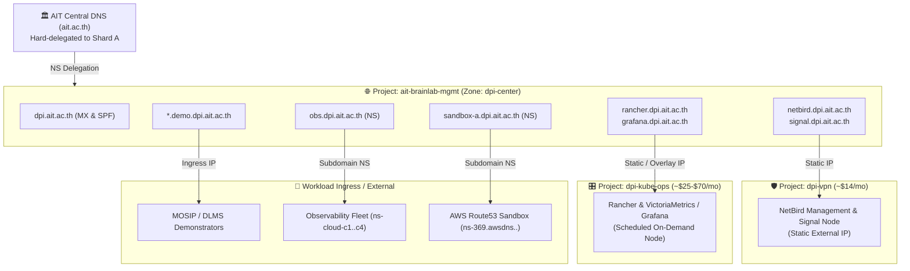

# Domain & DNS Architecture — DPI Center

## Overview
DPI Center operates under the public authoritative apex domain **`dpi.ait.ac.th`**, delegated by the Asian Institute of Technology (`ait.ac.th`) to Google Cloud DNS **Shard A** (`ns-cloud-a1.googledomains.com` – `ns-cloud-a4.googledomains.com`).

To avoid disrupting active parent delegation and prevent downtime across live services, the apex zone is permanently anchored in Google Cloud project **`ait-brainlab-mgmt`** (Managed Zone: `dpi-center`), while pointing cleanly to decoupled infrastructure across the **`dpi-base`** folder (`dpi-vpn`, `dpi-kube-ops`) and workload tiers.

---

## 🏛️ Cross-Project DNS Routing Architecture



---

## 📋 1. Managed DNS Records (`dpi.ait.ac.th`)

| Record / Hostname | Type | Target / Value | Hosting Project / Destination | Purpose |
| :--- | :---: | :--- | :--- | :--- |
| **`dpi.ait.ac.th`** | NS | `ns-cloud-a*.googledomains.com.` | `ait-brainlab-mgmt` | Authoritative parent delegation from `ait.ac.th` |
| **`dpi.ait.ac.th`** | MX | `10 mx1.improvmx.com.`, `20 mx2.improvmx.com.` | ImprovMX | Inbound email forwarding to operational admins |
| **`dpi.ait.ac.th`** | TXT | `v=spf1 include:spf.improvmx.com ~all` | Global Mail | SPF outbound mail authenticity policy |
| **`netbird.dpi.ait.ac.th`** | A | Static External IP | `dpi-vpn` | NetBird Management API & Admin Dashboard UI |
| **`signal.dpi.ait.ac.th`** | A | Static External IP | `dpi-vpn` | NetBird Signal service (WebRTC negotiation) |
| **`rancher.dpi.ait.ac.th`** | A | Static / Overlay IP | `dpi-kube-ops` | Rancher Multi-Cluster Kubernetes Manager |
| **`grafana.dpi.ait.ac.th`** | A | Static / Overlay IP | `dpi-kube-ops` | Observability & Telemetry Dashboards |
| **`obs.dpi.ait.ac.th`** | NS | `ns-cloud-c*.googledomains.com.` | Delegated GCP Zone | Central telemetry ingestion endpoints |
| **`sandbox-a.dpi.ait.ac.th`** | NS | `ns-*.awsdns-*.com/net/org/co.uk` | AWS Route 53 | Delegated developer sandbox environment |
| **`*.demo.dpi.ait.ac.th`** | A / CNAME | Workload Ingress | `dpi-workload-*` | Public demonstrator environments (MOSIP, DLMS) |
| **`mgmt.dpi.ait.ac.th`** | A / CNAME | Management Ingress | `dpi-mgmt` | Administrative management & GitOps endpoints |

---

## 🔒 2. DNS Governance Standard (The 3-Tier Policy)

To protect institutional reputation, eliminate subdomain takeovers, and prevent email outages, DNS creation follows a strict 3-tier boundary:

### Tier 1: Apex & Core Management (Strict GitOps Only)
* **Scope**: `dpi.ait.ac.th` apex, `MX`, `TXT`, `netbird`, `signal`, `rancher`.
* **Policy**: Zero direct editing via the GCP Console. Any change requires a **Pull Request** in this repository reviewed by Operating Administrators (`akraradet@ait.asia` or `nuttasit@ait.asia`).

### Tier 2: Dynamic Demonstrators & APIs (Kubernetes Ingress Automation)
* **Scope**: `*.demo.dpi.ait.ac.th`, `*.api.dpi.ait.ac.th`.
* **Policy**: Automated via Kubernetes **`external-dns`**. Developers deploy standard Ingress manifests; the controller creates and garbage-collects DNS records dynamically with zero manual intervention.

### Tier 3: Developer Sandboxes (Subdomain Delegation)
* **Scope**: `*.sandbox-a.dpi.ait.ac.th`, `*.dev.dpi.ait.ac.th`.
* **Policy**: Independent subzones delegated via NS records. Research teams hold full admin rights inside their isolated sandboxes with zero blast radius to the root apex domain.

---

## 🔍 3. Validation Commands

Run these commands from any terminal to verify live DNS propagation and delegation:

```bash
# Check Authoritative Nameservers for dpi.ait.ac.th
dig NS dpi.ait.ac.th +short

# Check Parent Delegation trace from root servers
dig dpi.ait.ac.th +trace

# Check Mail Exchange (MX) records
dig MX dpi.ait.ac.th +short

# Check TXT records (SPF policy)
dig TXT dpi.ait.ac.th +short

# Check Subdomain Delegations
dig NS obs.dpi.ait.ac.th +short
dig NS sandbox-a.dpi.ait.ac.th +short
```
