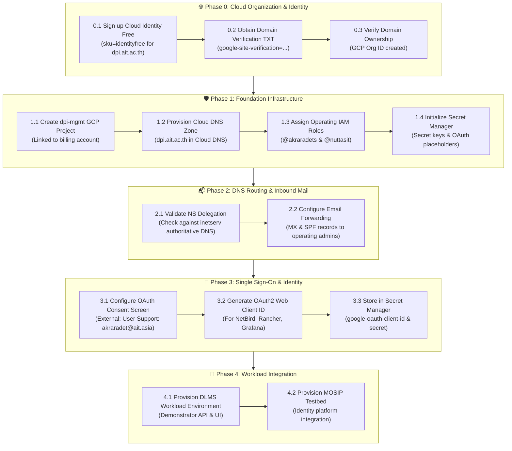

# DPI Center Operations & Implementation Checklist (`dpi-mgmt/checklist.md`)

**Architecture Version**: 1.0 (DPI Organization & Cloud Foundation)  
**Status Legend**: 🔴 Planned / Not Started | 🟡 In Progress | 🟢 Completed | 🔵 Verified Live

---

## 🏛️ Master Implementation Roadmap

---

## 📋 Detailed Task Tracking

### Phase 0: Cloud Organization & Identity (Phase 0 Foundation)
| Task ID | Task Description | Target Identity / Resource | Status | Notes / Output |
| :--- | :--- | :--- | :---: | :--- |
| `0.1` | Sign up for Google Cloud Identity Free | `dpi.ait.ac.th` | 🟢 | Org ID: `350922776586` ($0/mo Cloud Identity Free) |
| `0.2` | Verify Domain Ownership | `dpi.ait.ac.th` | 🟢 | Verified in Google Admin (`admin@dpi.ait.ac.th`) |
| `0.3` | Unlock Domain Restricted Sharing Policy | GCP Org Policy | 🟢 | `iam.allowedPolicyMemberDomains` relaxed for `@ait.asia` |
| `0.4` | Assign Organization Administrators | `akraradet@ait.asia`, `nuttasit@ait.asia` | 🟢 | Granted `organizationAdmin`, `projectCreator`, `billing.admin` |

### Phase 1: Foundation Infrastructure (`dpi-mgmt/terraform/`)
| Task ID | Task Description | Target Identity / Resource | Status | Notes / Output |
| :--- | :--- | :--- | :---: | :--- |
| `1.1` | Create management GCP project (`dpi-mgmt`) | `dpi-mgmt` (`189731855526`) | 🟢 | Linked to Base Platform billing account `0199A6-XXXXXX-XXXXXX` |
| `1.2` | Root GCP Folder (`dpi-base`) | GCP Resource Manager | 🟡 | Mirrors repo 1:1; consolidates billing & IAM inheritance |
| `1.3` | Enable core GCP APIs | Compute, DNS, IAM, Secret Manager | 🟢 | Enabled in `dpi-mgmt` |
| `1.4` | Set up Terraform remote state bucket (`gs://dpi-mgmt-tfstate`)| Cloud Storage | 🟢 | `asia-southeast1`, versioning ON, uniform access ON |
| `1.5` | Authoritative DNS Audit & Backup | `ait-brainlab-mgmt` | 🟢 | Exported full zone to `dpi-mgmt/dns-backups/` |
| `1.6` | Deploy CI/CD Service Account & Secret Manager | GCP IAM & Secret Manager | 🟡 | Ready to apply in `dpi-mgmt` |

### Phase 2: DNS Routing & Inbound Mail
| Task ID | Task Description | Target Identity / Resource | Status | Notes / Output |
| :--- | :--- | :--- | :---: | :--- |
| `2.1` | Validate nameserver delegation from authoritative DNS | `dpi.ait.ac.th` | 🟢 | Verified live on Shard A (`ns-cloud-a*.googledomains.com`) |
| `2.2` | Deploy MX records for email forwarding | ImprovMX | 🟢 | Verified live: `mx1.improvmx.com`, `mx2.improvmx.com` |
| `2.3` | Deploy SPF TXT records | Cloud DNS | 🟢 | Verified live: `v=spf1 include:spf.improvmx.com ~all` |
| `2.4` | Subdomain Routing (NetBird, Rancher, Ingress) | Cross-Project Routing | 🟡 | Target static IPs in `dpi-vpn` and `dpi-kube-ops` |

### Phase 3: Single Sign-On (Google OAuth2 / OIDC)
| Task ID | Task Description | Target Identity / Resource | Status | Notes / Output |
| :--- | :--- | :--- | :---: | :--- |
| `3.1` | Configure OAuth Consent Screen | GCP Console | 🔴 | User Type: External (User Support: `akraradet@ait.asia`) |
| `3.2` | Create OAuth 2.0 Web Client ID | GCP Credentials | 🔴 | For NetBird, Rancher, Grafana, demonstrators |
| `3.3` | Seed OAuth Client ID & Secret to Secret Manager | GCP Secret Manager | 🔴 | Stored securely for zero-drift automation |

### Phase 4: Workload Plane Integration
| Task ID | Task Description | Target Identity / Resource | Status | Notes / Output |
| :--- | :--- | :--- | :---: | :--- |
| `4.1` | DLMS Project Ingress & DNS | `dlms.demo.dpi.ait.ac.th` | 🔴 | Driving Licensing Management System |
| `4.2` | MOSIP Demonstration Deployment | `mosip.demo.dpi.ait.ac.th` | 🔴 | Digital identity testbed |
