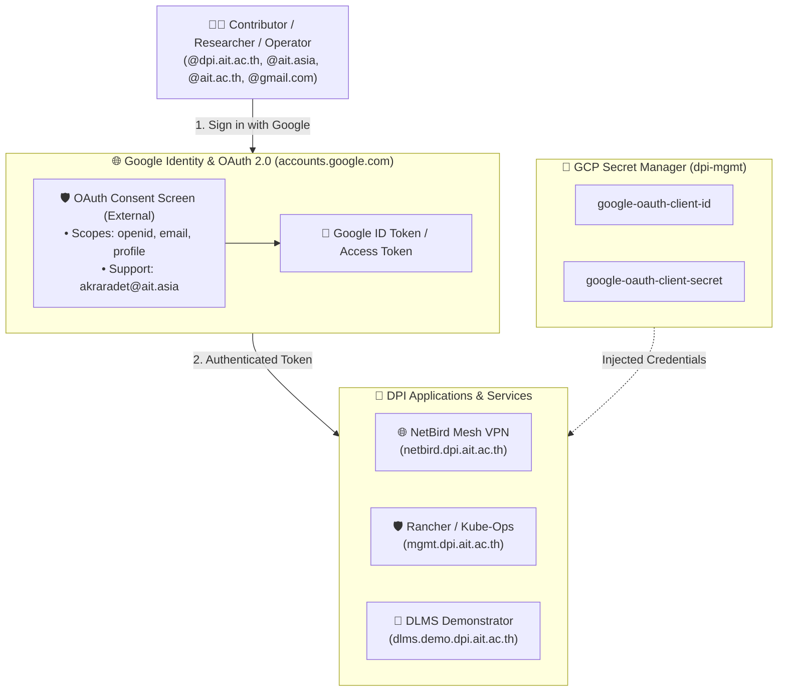

# 🔑 Google OAuth2 / OIDC Setup Guide (`dpi-mgmt/oauth_setup.md`)

> **The Permanent Identity Provider**: Google OAuth2 handles 100% of human authentication and Single Sign-On (SSO) across DPI Center web portals, demonstrators, and administrative consoles using authorized Google accounts.

---

## 🛡️ Why This is a One-Time Console Step (Phase 0 Foundation)

Google Cloud Platform enforces a strict security boundary: **Generic OAuth 2.0 Web Client IDs cannot be created via Terraform or API**. 

Google intentionally requires a human project owner to approve the **OAuth Consent Screen** (branding, privacy policy, contact email) in the Google Cloud Console. 

Once created, the credentials are saved into **GCP Secret Manager**, and all subsequent deployments and applications read them automatically via configuration.

---

## 🏗️ DPI Single Sign-On Architecture



---

## 📋 Step-by-Step Operator Runbook

### Step 1: Configure OAuth Consent Screen
1. Open the [**GCP OAuth Consent Screen**](https://console.cloud.google.com/apis/credentials/consent).
2. Select **User Type**: **External** (REQUIRED).
   > [!IMPORTANT]
   > **Why "External" is Mandatory**:  
   > An "Internal" OAuth consent screen strictly limits logins to accounts in the `@dpi.ait.ac.th` Cloud Identity directory and will **fail with 403** for `@ait.asia`, `@ait.ac.th`, and `@gmail.com` users.  
   > Selecting **External** allows Google to authenticate users from:
   > - `@dpi.ait.ac.th` (DPI Cloud Identity accounts)
   > - `@ait.asia` (AIT university operational accounts)
   > - `@ait.ac.th` (Institutional academic accounts)
   > - `@gmail.com` (Designated partner & personal accounts)
3. Fill in the application registration fields:
   - **App Name**: `DPI Center Services`
   - **User Support Email**: `akraradet@ait.asia`
   - **Authorized Domains**: `dpi.ait.ac.th`
   - **Developer Contact Information**: `akraradet@ait.asia`, `nuttasit@ait.asia`
4. Under **Scopes**, select the standard OIDC scopes:
   - `.../auth/userinfo.email`
   - `.../auth/userinfo.profile`
   - `openid`
5. Under **Test Users** (if published status is Testing):
   - Add initial administrative accounts (`akraradet@ait.asia`, `nuttasit@ait.asia`, and any test `@gmail.com` accounts).
6. Click **Save and Continue**.

---

### Step 2: Create the OAuth 2.0 Web Client ID
1. Navigate to the [**GCP Credentials Page**](https://console.cloud.google.com/apis/credentials).
2. Click **`+ CREATE CREDENTIALS`** $\rightarrow$ **OAuth client ID**.
3. Set **Application type**: **Web application**.
4. Set **Name**: `DPI Center Core SSO`.
5. **Authorized JavaScript Origins**:
   ```text
   https://dpi.ait.ac.th
   https://mgmt.dpi.ait.ac.th
   https://netbird.dpi.ait.ac.th
   https://rancher.dpi.ait.ac.th
   https://grafana.dpi.ait.ac.th
   https://demo.dpi.ait.ac.th
   https://dlms.demo.dpi.ait.ac.th
   ```
6. **Authorized Redirect URIs**:
   ```text
   # NetBird Mesh VPN
   https://netbird.dpi.ait.ac.th/callback
   https://netbird.dpi.ait.ac.th/silent-callback
   http://localhost:53000

   # Rancher Community Manager
   https://rancher.dpi.ait.ac.th/verify-auth
   https://rancher.mgmt.dpi.ait.ac.th/verify-auth

   # Observability (Grafana)
   https://grafana.dpi.ait.ac.th/login/generic_oauth

   # Demonstrators & Local Testing
   https://demo.dpi.ait.ac.th/auth/callback
   https://dlms.demo.dpi.ait.ac.th/auth/callback
   http://localhost:8000/auth/callback
   ```
   *(Note: `http://localhost:53000` is used by the NetBird desktop & CLI client local login loopback).*
7. Click **CREATE**.

---

### Step 3: Store Client ID & Secret in GCP Secret Manager

Once generated, save the credentials into GCP Secret Manager:

```bash
# Set variables
CLIENT_ID="<your-oauth-client-id>.apps.googleusercontent.com"
CLIENT_SECRET="<your-oauth-client-secret>"

# Store in Secret Manager
echo -n "$CLIENT_ID" | gcloud secrets versions add google-oauth-client-id --project=dpi-mgmt --data-file=-
echo -n "$CLIENT_SECRET" | gcloud secrets versions add google-oauth-client-secret --project=dpi-mgmt --data-file=-
```

---

## 🌐 NetBird Multi-Domain Access Policy

### Target Domain Whitelist
NetBird VPN accepts logins from Google accounts belonging to any of the following 4 domains:
1. **`@dpi.ait.ac.th`**: DPI Center Cloud Identity accounts.
2. **`@ait.asia`**: AIT university staff & faculty Google Workspace accounts.
3. **`@ait.ac.th`**: Institutional academic accounts.
4. **`@gmail.com`**: Designated partner, student, and personal Google accounts.

### Authentication vs. Authorization Boundary
```
┌─────────────────────────────────────────────────────────────┐
│ 1. AUTHENTICATION (Google Cloud OAuth2 / OIDC)              │
│    • User Type: External                                    │
│    • Verifies Google identity across all 4 domains          │
└──────────────────────────────┬──────────────────────────────┘
                               │ Authenticated ID Token
┌──────────────────────────────▼──────────────────────────────┐
│ 2. AUTHORIZATION (NetBird Management Server)                │
│    • Policy: User Approval Workflow Enabled                 │
│    • Admin (@akraradet, @nuttasit) approves new peers       │
│    • Prevents public Google accounts from joining mesh VPN  │
└─────────────────────────────────────────────────────────────┘
```

> [!TIP]
> **NetBird Setup**: In the NetBird Management Dashboard (**Settings $\rightarrow$ Identity Providers**), select **Google** or **OIDC**, paste the `google-oauth-client-id` and `google-oauth-client-secret`, and set the callback URL to `https://netbird.dpi.ait.ac.th/callback`. Ensure **Auto-approval** is disabled so only authorized team members are granted mesh IP routing.

---

## 🐮 Rancher & Observability (Grafana) OAuth Integration

Rancher and Grafana reuse the **exact same** Google OAuth2 credentials stored in `dpi-mgmt` Secret Manager, providing unified Single Sign-On (SSO) across the entire platform.

### Rancher Configuration
1. **Initial Bootstrap**: On initial deployment, Rancher creates a temporary bootstrap password for `admin`.
2. **Enable Google / OIDC Auth Provider**:
   - Navigate to **Global Settings** $\rightarrow$ **Users & Authentication** $\rightarrow$ **Auth Provider**.
   - Select **Google** (or **Generic OIDC** pointing to `https://accounts.google.com`).
   - Enter `google-oauth-client-id` and `google-oauth-client-secret`.
   - Ensure the Rancher Server URL is set to `https://rancher.dpi.ait.ac.th`.
   - Rancher uses the redirect URI: `https://rancher.dpi.ait.ac.th/verify-auth`.
3. **Rancher RBAC & Access Mode**:
   - Set **Access Mode** to: **"Restricted"** (or *"Allow members of Clusters and Projects, plus Authorized Users"*).
   - **Zero-Trust Role Binding**: Authenticated Google users from the 4 domains (`@dpi.ait.ac.th`, `@ait.asia`, `@ait.ac.th`, `@gmail.com`) will only see clusters or projects they have been explicitly granted membership to by an administrator.

### Grafana Configuration (`grafana.dpi.ait.ac.th`)
* Grafana uses the same credentials via `[auth.google]` or `[auth.generic_oauth]` in its Helm values, redirecting to `https://grafana.dpi.ait.ac.th/login/generic_oauth`.


